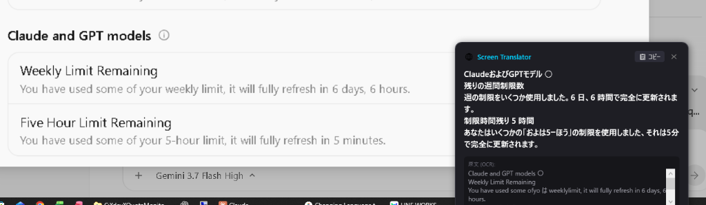
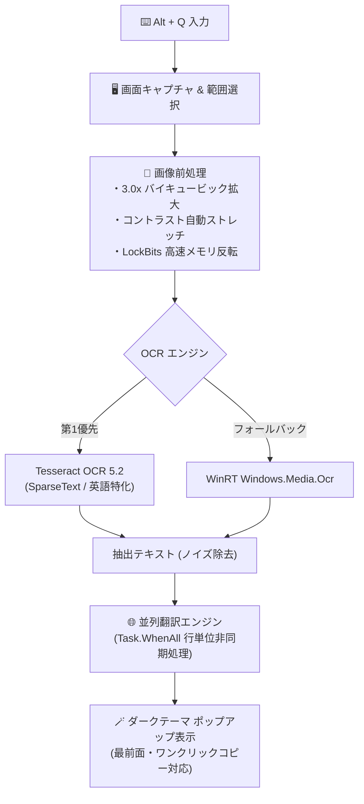

# 📸 Screen Translator

<p align="center">
  <a href="https://github.com/konikatsu/ScreenTranslator/releases"></a>
  
  
  
  
</p>

<p align="center">
  <b>ショートカットキー（<code>Alt + Q</code>）で画面を囲むだけ！<br>英語UI・エラー・設定メニューを一瞬で文字認識＆日本語翻訳する超軽量デスクトップ常駐ツール</b><br>
  <i>A blazing-fast, lightweight Windows screen OCR & instant translation tool powered by a hybrid Tesseract + WinRT engine.</i>
</p>

---

## 💡 このツールで解決できること

開発ツール（IDE、Antigravity、Blenderなど）や海外製ソフトウェアを使っているとき、**「この英語メニューやエラーダイアログ、コピーできない画像文字だけど今すぐ意味を知りたい！」** と思ったことはありませんか？

- ❌ ブラウザの翻訳機能はデスクトップアプリやダイアログには使えない
- ❌ スマホのカメラを向けて Google レンズで撮るのは面倒
- ❌ 手動で英語をタイピングして DeepL に貼るのは時間がかかる
- ✅ **Screen Translator なら、`Alt + Q` を押してドラッグするだけで 0.5 秒でその場に翻訳が表示されます！**

---

## 📸 デモ・スクリーンショット (Demo)



> 💡 **操作の流れ**: `Alt + Q` を押す ➔ 翻訳したい範囲をマウスドラッグ ➔ マウスカーソルのすぐ横に翻訳結果がスマートにポップアップ！

---

## ✨ 主な特徴 (Features)

* **⚡ グローバルショートカット (`Alt + Q`)**
  * どのアプリを開いていても瞬時に画面キャプチャオーバーレイが起動。
* **🔍 ハイブリッドOCRエンジン（高精度認識）**
  * 高精度な **Tesseract OCR (eng)** をメインに、Windows 10/11 標準の **WinRT OCR** をフォールバックとして自動連携。
* **🎨 UI特化の高度な画像前処理パイプライン**
  * 小さなメニューフォントや薄いグレー文字、黒背景白文字（ダークモード）を自動判定。**3.0倍バイキュービック拡大 ＆ コントラスト自動強調 ＆ LockBits 高速メモリ処理** により誤読を徹底防止。
* **🌐 超高速・並列翻訳**
  * 複数行の設定項目やリストも元の改行レイアウトを崩さず、非同期並列で一瞬で翻訳。
* **🎈 超軽量タスクトレイ常駐（メモリ 15〜30MB）**
  * PC の動作を一切重くせず、バックグラウンドで静かにスタンバイ。

---

## 🚀 クイックスタート (Installation & Usage)

### 1. ダウンロード
[👉 最新リリースページ](https://github.com/konikatsu/ScreenTranslator/releases/latest) から **`ScreenTranslator-v1.0.0.zip`** をダウンロードします。

### 2. 解凍して配置
ダウンロードした ZIP ファイルを任意のフォルダ（例: `C:\Tools\ScreenTranslator`）に解凍します。
```text
ScreenTranslator/
├── ScreenTranslator.exe   # 実行ファイル
└── tessdata/              # OCR 言語データ
    └── eng.traineddata
```

### 3. 起動と使い方
1. `ScreenTranslator.exe` を起動します（タスクトレイに常駐します）。
2. 翻訳したい画面で **`Alt + Q`** を押します。
3. 翻訳したい範囲をマウスでドラッグして囲みます。
4. 翻訳ポップアップが表示されます（テキストのワンクリックコピーも可能）。
5. ポップアップの外側をクリックするか `ESC` キーで閉じます。

> [!NOTE]
> **Windows SmartScreen の警告が出た場合:**  
> 個人開発のオープンソースアプリのため、初回起動時に警告が出る場合があります。「詳細情報」をクリックし、「実行」を選択してください。

---

## 🏗️ 内部アーキテクチャ (How it Works)



---

## 🛠️ ソースコードからのビルド (Build from Source)

前提条件: [.NET 10.0 SDK](https://dotnet.microsoft.com/download)

```bash
# リポジトリのクローン
git clone https://github.com/konikatsu/ScreenTranslator.git
cd ScreenTranslator

# ビルド & パブリッシュ
dotnet publish -c Release -r win-x64 --self-contained -p:PublishSingleFile=true -o ./publish

# tessdata フォルダのコピー
xcopy /E /I tessdata .\publish\tessdata
```

---

## 🗺️ ロードマップ (Upcoming Features)

- [ ] ショートカットキーのカスタマイズ機能（設定画面）
- [ ] 翻訳言語の双方向切り替え（日→英、他言語対応）
- [ ] 翻訳履歴の保存・閲覧機能

---

## 📄 ライセンス (License)

[MIT License](LICENSE) © 2026 konikatsu
